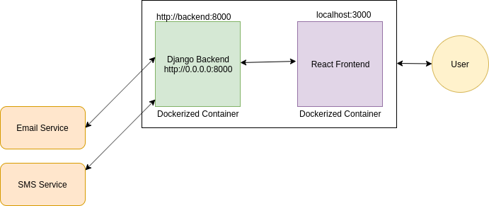

# CheckIn Desk

CheckIn Desk is a ReactJS, Django powered app which is production ready with the help of Docker


### Tech


* React.js - for a cool frontend
* Django - for a robust backend
* Docker - to make the application scalable and production ready

### Installation
I would suggest to run the application on a virtual environment to make sure the libraries installed during the process is not mixed up.
Please use Python3 for the whole setup
We require to install only three dependencies manually, rest are taken care by docker itself.
* [Docker Engine](https://www.digitalocean.com/community/tutorials/how-to-install-and-use-docker-on-ubuntu-16-04)
* [Docker-compose](https://docs.docker.com/compose/install/)
* [Node.js](https://nodejs.org/en/)
The links given are based on linux OS, if you have a different OS, please refer on web on how  to install the above on your OS

After the above three are succesfully installed, we need to clone this repository, and run docker-compose up, the first time this command will build the image, which may take some time (approx. 7~9 mins)
```sh
$ git clone https://github.com/vishal2106/checkin_project.git
$ cd checkin_project
$ docker-compose up 
```
The above command will successfully start the Django and React servers. 
Visit ``` localhost:3000 ``` in your browser to see the application.

### Working
The project uses Django as backend and React.js as frontend. All the POST and GET requests are handles by axios package by npm inside React. The backend receives the request and serializes the data and sends the response if it's a GET request and save the data in the django in-built sqllite DB if it's a POST request. Django also handles the email and SMS service. The email service is Django's buit in function, the SMS service is an API provided by way2sms.
During checkin, Django send an email and sms to the host, and during checkout it sends the email and sms to the guest.

The checkin and checkout is taking a 5 sec lag because of the email and sms requests.(To be fixed in the next release)

### Screenshots

The Homepage

The checkin Form. ```The form details must be accurate, i.e., the email and number must be valid otherwise the data may not be saved in the database```

The User details is saved in the DB and rendered

The user is checked out.
 
 
The screenshots of host's and guest's notification

### Todos

 - Deploy the container live
 - Fix minor bugs


